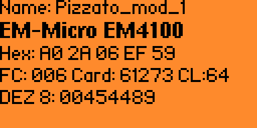
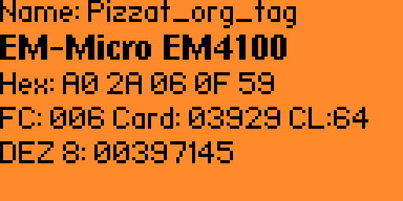

# General Information about the Tag
SR DD420MK-D1T

Pin 1 and 3 are the power pins as specified by the manual. 
-> takes 24 V constantly 
-> around 12mA when ideling and no tag in range 
-> around 15~16mA when ideling and tag in range

-> It can ONLY hold a single tag as valid -> no multi tag support in our Version 
It appears to use the EM4100 Tags for identification. 

A2 is ground(sort of)

if Tag is recognized O3 is high(23.2 V) otherwiese its at 0.331V
-> messured between pin 5 and - output from bench powersupply 

## Behaviour with tags 

-> If tag with modified data (that does not match the original tag 2 modiefied bits in hex decimal) The reader does not throw out any visable error code -> it only gives an output in form of 
and LED lighting up green when the correct tag is held infront of it. 

-> it has an extreamly narrow range, of only a few cm, so its hard to even fit something between the Tag and the reader. -> extending the range by a few cm would be interesing
-> the flipper 0 has a slightly longer range than the Pizzato Reader 

# Copying and emulating the Tag

The tag DOES NOT Contain any other Data other than an ID which in my case is `A02A060F59`

## Output from the Proxmark 3

The following thing also backs the flipper results
```
+] EM 410x ID A02A060F59
[+] EM410x ( RF/64 )
[=] -------- Possible de-scramble patterns ---------
[+] Unique TAG ID      : 055460F09A
[=] HoneyWell IdentKey
[+]     DEZ 8          : 00397145
[+]     DEZ 10         : 0705040217
[+]     DEZ 5.5        : 10758.03929
[+]     DEZ 3.5A       : 160.03929
[+]     DEZ 3.5B       : 042.03929
[+]     DEZ 3.5C       : 006.03929
[+]     DEZ 14/IK2     : 00687899807577
[+]     DEZ 15/IK3     : 000022890475674
[+]     DEZ 20/ZK      : 00050504060015000910
[=] 
[+] Other              : 03929_006_00397145
[+] Pattern Paxton     : 2686078297 [0xA01A4D59]
[+] Pattern 1          : 591822 [0x907CE]
[+] Pattern Sebury     : 3929 6 397145  [0xF59 0x6 0x60F59]
[+] VD / ID            : 160 / 0705040217
[+] Pattern ELECTRA    : 41002 397145
[=] ------------------------------------------------

[+] Valid EM410x ID found!
```


## Flipper


I was hopting that this would be more difficult, it wasnt. The flipper can just read + emulate the Tags. 
They are EM - Micro EM4100 Tags-> atleast from what the flipper is saying. Industrial standart ones,
-> The flipper zero also already has the possibility for doing a bit of fuzzing for this standart

[Datasheet for EM200](https://www.emmicroelectronic.com/sites/default/files/products/datasheets/em4200_ds.pdf)
[Datasheet for EM100](https://www.alldatasheet.com/html-pdf/154654/EMMICRO/EM4100/293/1/EM4100.html)


Since that was so easy and could not really be called research I looked into some other ways to missuse this thing. 

# Other evenues of attack 

- the pins on the back 
- maybe power analyis ? 
- generating abitrary keys with the flipper -> doable using the then write pin
- extending range of original tag?
  -> replay attacks


Since there is not a lot of time left and the abouve would likely take quite a bit of time and new expertiese There are a few things that I want to try instead 

- [ ] creating a tag with to much and too little information
- [ ] creating a tag with a wrong format ( but still and EM tag) same and different ID 
- [X] trying to write a new tag to the tag included with the device

  
# Actually testing some things 

##  creating a tag with to much and too little information

### What I want to see 

optimally this does not respond to any of these tags and does not register them in a way 

### Trying these things
we will use the 
```proxmark 
lf em 410x sim --id <id-data in hex>

```

command for the too short one, since I have not found a better id maybe I could also try to to give it a longer one and see what it does with that 

The following commands are the ones that I am trying 
```proxmark 

```

#### trying a mirrord tag with short delay between 

since we can set the gap to 0, it would be interesting if we used a tag that was mirrord in the middel and only gave it half of the tag as input data to emulte but due to it being mirror it would and the low dealy it would be recognized as one tag. The Original programming will be done with the flipper. 


The Tag in that I will use is the flipper
![../images/]


```proxmark 
lf em 410x sim --id A02A0A02A0 --gap 0
```
the gap 0 was required so it appears to read it as a stream? Maybe since the proxmark does not support smaller tags I could not test what I originally wanted to try. 

It does use the 64 clock. A 32 one wont work. 

This is new information to me 


## creating a tag with a wrong format ( but still and EM tag) same and different ID

does not seem feesable, I mean it is possible, since a 7755 Tag. This would be abel to act asn a EM4100 Tag. those cannot be emulated with the proxmark nor the flipper. 
Maybe in the future. I have not found something atleast from the docu that would be compatible with this tag. 

## trying to write a new tag to the tag included with the device

It just breaks the Tag. The tag will not be able to be read afterwards. 

They are genuine EM410x tags since those are read only which is true for my tag and its not a t5577 tag which can be rewriten. 
Some information seems to be overwriten since they are not recgnozed by any reader afterwards neither the original reader nor the proxmark 3 nor the flipper. 


From what I found the way that EM4100 tags are created is that efuses are created and trying to write to them seems to blow them. 


[source for knowing that its read only](https://old.reddit.com/r/proxmark3/comments/vs9yd9/possible_to_clone_t55xx_to_em410x/)


# How Keys are generated 

A further deep dive into EM100. 

## Notes to take away 

- Keys are etched into the Hardware so rewriting them _should_ not be possibel. 
- only a coild is needed to recieve power ? -> very simple logic should allow for replay attacks

### Possible Encodings
- Manchester 
- Biphase code 
- PSK


Proxmark recongineses patterns with Manchester decoding-> so most likely it uses the manchester Encoding 


the raw data
```
[+] 11111010111111011101000000100101
[+] 10011111111100011111111000100011
[+] 11111010111111011101000000100101
[+] 10011111111100011111111000100011
[+] 11111010111111011101000000100101
[+] 10011111111100011111111000100011
[+] 11111010111111011101000000100101
[+] 10011111111100011111111000100011
[+] 11111010111111011101000000100101
[+] 10011111111100011111111000100011
[+] 11111010111111011101000000100101
[+] 10011111111100011111111000100011
[+] 11111010111111011101000000100101
[+] 10011111111100011111111000100011
[+] 11111010111111011101000000100101
[+] 10011111111100011111111000100011
[+] 11111010111111011101000000100101
[+] 10011111111100011111111000100011
[+] 11111010111111011101000000100101
[+] 10011111111
```

the modified buffer after running 


```proxmark
pm3 --> data rawdemod --am
```

```
[+] DemodBuffer:
[+] 00000110000000111100101010010011
[+] 10111111111101000000000101101000
[+] 00000110000000111100101010010011
[+] 10111111111101000000000101101000
[+] 00000110000000111100101010010011
[+] 10111111111101000000000101101000
[+] 00000110000000111100101010010011
[+] 10111111111101000000000101101000
[+] 00000110000000111100101010010011
[+] 10111111111101000000000101101000
[+] 00000110000000111100101010010011
[+] 10111111111101000000000101101000
[+] 00000110000000111100101010010011
[+] 10111111111101000000000101101000
[+] 00000110000000111100101010010011
[+] 10111111111101000000000101101000
[+] 00000110000000111100101010010011
[+] 10111111111101000000000101101000
[+] 00000110000000111100101010010011
[+] 10111111111
```


## Replay Attacks 
originl messurable distance before light starts to blink orange/green 11.77mm this messurement ist perfekt but should give a baseline.

A [Forum post ](https://electronics.stackexchange.com/questions/99135/what-can-i-do-to-increase-passive-hf-rfid-read-range) about a similar topic. That could help me find things that could work to extend its range.

A [research paper ](https://www.sciencedirect.com/science/article/abs/pii/S0167923619302234) into that topic, that could be of interest.


## generating abitrary tags with the flipper


After simply copying the tag we are able to modify the hex value of the tag.
+
In the following images you show you the two modified tags




these can be saved to the device, 


[Proxmark forum](http://proxmark.org/forum/viewtopic.php?id=4400) 
## Sniffing with SDR


[Replay ](https://www.blackhillsinfosec.com/how-to-replay-rf-signals-using-sdr/)

This didnt turn out as planned and did not work with my cheap RTL-SDR. I didnt manage to detect anything my thing might have not been sensitiv enough


# Attacking this thing with a laser 


I think you could theoretically trigger an "open state" when shooting a laser at the LED that indicates if the thing has deteced a tag or not. 
